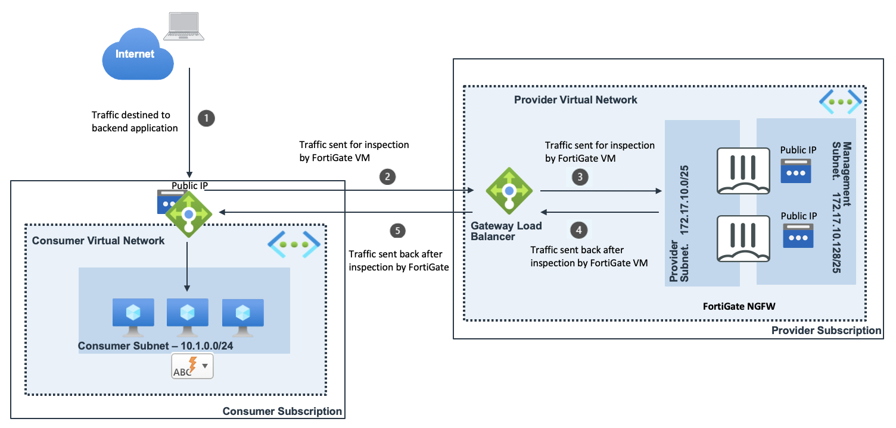

# FortiGate Next-Generation Firewall in Azure GWLB

## Introduction

More and more enterprises are turning to Microsoft Azure to extend or replace internal data centers and take advantage of the elasticity of the public cloud. While Azure secures the infrastructure, you are responsible for protecting the resources you put in it. As workloads are being moved from local data centers connectivity and security are key elements to take into account. FortiGate-VM offers a consistent security posture and protects connectivity across public and private clouds, while high-speed VPN connections protect data.

This ARM template deploys a pair of FortiGate Next-Generation Firewall accompanied by an Azure Gateway Load Balancer into a "provider" network. This can be then linked from one or more consumer networks using Standard Load Balancers with rules configured to forward to Azure hosts.  With the Azure Gateway Load Balancer referenced from the standard load balancer, all traffic will be forwarded first to one of the FortiGates by way of the Gateway Load Balancer before being sent to the backend pool members of the Standard Load Balancer.

## Design

As you can see in the diagram, the Gateway Load Balancer and associated backend pool will sit as a shim in between the Standard Load Balancer Frontend and Backend.  Thus all traffic in or out of the Standard Load balancer will be forwarded to the Gateway Load Balancer and inspected by a FortiGate.

## Deployment

For the deployment, you can use the Azure Portal, Azure CLI, Powershell or Azure Cloud Shell. The Azure ARM templates are exclusive to Microsoft Azure and can't be used in other cloud environments. The main template is the `azuredeploy.json` which you can use in the Azure Portal. 

### Azure Portal

## Requirements and limitations

This template only deploys the Gateway Load Balancer and FortiGates.  It does not provide the consumer side of the deployment.  A typical use case may have a Managed Security Services Provider deploy the FortiGates in their subscription, and one of their customers deploy the consumer side of the solution in their subscription, using the subscription ID and Resource Group of the MSSP's deployment to link the two together.  A sample consumer template is also included.

The ARM template deploys different resources and it is required to have the access rights and quota in your Microsoft Azure subscription to deploy the resources.

- The template will deploy Standard F4s VMs for this architecture. Other VM instances are supported as well with a minimum of 2 NICs. A list can be found [here](https://docs.fortinet.com/document/fortigate/6.4.0/azure-cookbook/562841/instance-type-support)
- Licenses for Fortigate
  - BYOL: A demo license can be made available via your Fortinet partner or on our website. These can be injected during deployment or added after deployment. Purchased licenses need to be registered on the [Fortinet support site](http://support.fortinet.com). Download the .lic file after registration. Note, these files may not work until 30 minutes after it's initial creation.
  - PAYG or OnDemand: These licenses are automatically generated during the deployment of the FortiGate systems.
  - The password provided during deployment must need password complexity rules from Microsoft Azure:
  - It must be 12 characters or longer
  - It needs to contain characters from at least 3 of the following groups: uppercase characters, lowercase characters, numbers, and special characters excluding '\' or '-'
- The terms for the FortiGate PAYG or BYOL image in the Azure Marketplace needs to be accepted once before usage. This is done automatically during deployment via the Azure Portal. For the Azure CLI the commands below need to be run before the first deployment in a subscription.
  - BYOL
`az vm image accept-terms --publisher fortinet --offer fortinet_fortigate-vm_v5 --plan fortinet_fg-vm`
  - PAYG
`az vm image accept-terms --publisher fortinet --offer fortinet_fortigate-vm_v5 --plan fortinet_fg-vm_payg_20190624`

## FortiGate configuration

The FortiGate VMs need a specific configuration to match the deployed environment. The basic configuration is already setup through the UserData portion of the ARM template.  This includes VXLAN tunnels from each FortiGate to the Gateway Load Balancer.  These provide the external and internal interfaces which are configured as a virtual wire pair.  Thus, all communication between the Gateway Load Balancer and FortiGate occur at layer 2 within these tunnels.  The following shows the basic configuration which is already included in the template.  Notice that the policy allows all traffic, but does enable IPS and logging.  This can be modified and restricted as necessary.  The policy here is only an initial example which does allow traffic to flow.

`config system interface`
    `edit "port1"`
        `set vdom "root"`
        `set mode dhcp`
        `set allowaccess probe-response`
        `set type physical`
        `set description "Provider"`
        `set snmp-index 1`
        `set defaultgw disable`
        `set mtu-override enable`
        `set mtu 1570`
    `next`
    `...`
    `edit "extvxlan"`
        `set vdom "root"`
        `set type vxlan`
        `set snmp-index 7`
        `set interface "port1"`
    `next`
    edit "intvxlan"
        set vdom "root"
        set type vxlan
        set snmp-index 8
        set interface "port1"
    next
end
config system vxlan
    edit "extvxlan"
        set interface "port1"
        set vni 801
        set dstport 2001
        set remote-ip "172.16.10.4"
    next
    edit "intvxlan"
        set interface "port1"
        set vni 800
        set dstport 2000
        set remote-ip "172.16.10.4"
    next
end
config system virtual-wire-pair
    edit "vxlanvwpair"
        set member "extvxlan" "intvxlan"
    next
end
config firewall policy
    edit 1
        set name "int-ext_vxlan"
        set uuid 038cba3e-3b9e-51ec-9385-3103e08bbede
        set srcintf "extvxlan" "intvxlan"
        set dstintf "extvxlan" "intvxlan"
        set action accept
        set srcaddr "all"
        set dstaddr "all"
        set schedule "always"
        set service "ALL"
        set utm-status enable
        set ssl-ssh-profile "certificate-inspection"
        set ips-sensor "default"
        set logtraffic all
    next
end

## Support

Fortinet-provided scripts in this and other GitHub projects do not fall under the regular Fortinet technical support scope and are not supported by FortiCare Support Services.
For direct issues, please refer to the [Issues](https://github.com/40net-cloud/fortinet-azure-solutions/issues) tab of this GitHub project.

## License

[License](LICENSE) © Fortinet Technologies. All rights reserved.
